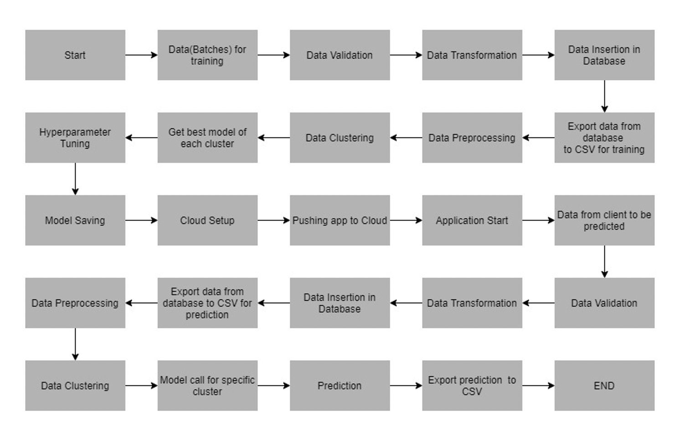

## Thyroid Fault Detection

#### Problem Statement:

To build a classification methodology to predict the type of Thyroid based on the given training data. 

#### Project Architecture

## TRAINING

#### Data Description

Data will contain different classes of thyroid and 30 columns of different values. "Class" column will have four unique values “negative, compensated_hypothyroid,
primary_hypothyroid, secondary_hypothyroid”.

Apart from training files, we also require a "schema", which contains all the relevant information about the training files such as:
Name of the files, Length of Date value in FileName, Length of Time value in FileName, Number of Columns, Name of the Columns, and their datatype.

#### Data Validation 

In this step, different sets of validation on the given set of training files are performed.  

1.  Name Validation- Name of the files based on the given name in the schema file is validated. Regex pattern is created as per the name given in the schema file to use for validation. After validating the pattern in the name, the length of date in the file name as well as the length of time in the file name is checked. If all the values are as per requirement, the files are moved to "Good_Data_Folder" else "Bad_Data_Folder."

2.  Number of Columns - Number of columns present in the files are validated, and if it doesn't match with the value given in the schema file, then the file is moved to "Bad_Data_Folder."

3.  Name of Columns - The name of the columns is validated and should be the same as given in the schema file. If not, then the file is moved to "Bad_Data_Folder".

4.  The datatype of columns - The datatype of columns is given in the schema file. This is validated when we insert the files into Database. If the datatype is wrong, then the file is moved to "Bad_Data_Folder".

5. Null values in columns - If any of the columns in a file have all the values as NULL or missing, we discard such a file and move it to "Bad_Data_Folder".

#### Data Insertion in Database

1) Database Creation and connection - Create a database with the given name passed. If the database is already created, open the connection to the database. 

2) Table creation in the database - Table with name - "Good_Data", is created in the database for inserting the files in the "Good_Data_Folder" based on given column names and datatype in the schema file. If the table is already present, then the new table is not created and new files are inserted in the existing table as the training has to be done on new as well as old training files.  

3) Insertion of files in the table - All the files in the "Good_Data_Folder" are inserted in the above-created table. If any file has invalid data type in any of the columns, the file is not loaded in the table and is moved to "Bad_Data_Folder".

#### Model Training 

1) Data Export from Db - The data in a stored database is exported as a CSV file to be used for model training.
2) Data Preprocessing  

   a) Drop columns which are not useful for training the model. Such columns were selected while doing the EDA.

   b) Replace the invalid values with numpy “nan” so we can use imputer on such values.

   c) Encode the categorical values.

   d) Check for null values in the columns. If present, impute the null values using the KNN imputer on some features and median imputation on the rest.

   e) After imputation, handle the imbalanced dataset by using RandomOverSampler.

3) Clustering - KMeans algorithm is used to create clusters in the preprocessed data. The optimum number of clusters is selected by plotting the elbow plot, and for the dynamic selection of the number of clusters, "KneeLocator" function is used. The idea behind clustering is to implement different algorithms to train data in different clusters. The Kmeans model is trained over preprocessed data and the model is saved for further use in prediction.
4) Model Selection - After clusters are created, the best model is selected for each cluster by using two algorithms, "Random Forest" and "KNN". For each cluster, both the algorithms are passed with the best parameters derived from RandomSearch. The AUC scores for both models are calculated and the model with the best score is chosen. Similarly, the model is selected for each cluster. All the models for every cluster are saved for use in prediction. 

## VALIDATION

- All the above steps are repeated on the validation set till Clustering the data. Once the data is clustered, based on the cluster number, the respective model is loaded and is used to predict the data for that cluster. 
- After the prediction is done for all the clusters, the predictions along with the column names are saved in a CSV file at a given location and the location is returned to the client.

## Ops Pipeline

- Used GitHub Actions for continuous integration and continuous delivery (CI/CD).

## Model Deployment

- Model deployed to Heroku Cloud platform

